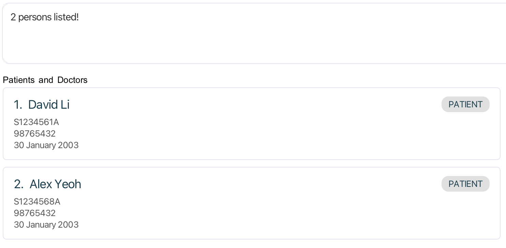
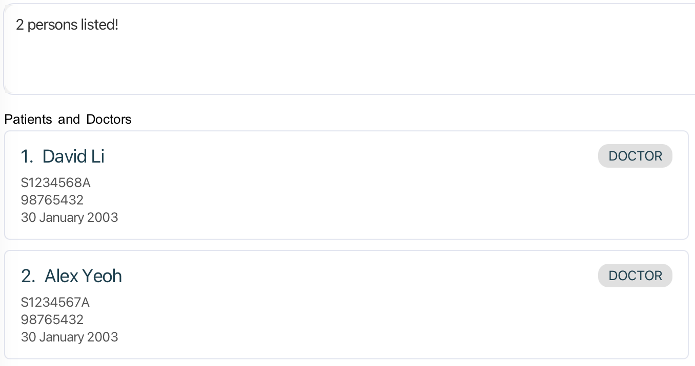
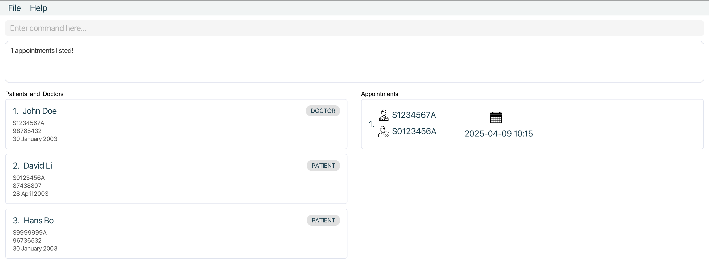
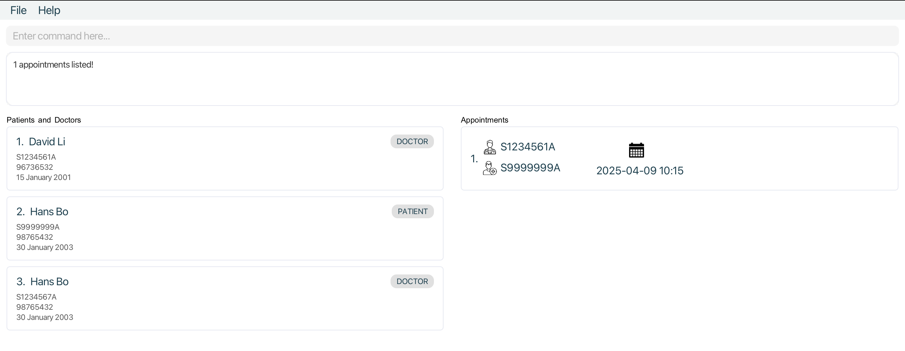

        
MediCLI is a **desktop app for managing persons involved in a hospital, optimized for use via a Command Line Interface** (CLI) while still having the benefits of a Graphical User Interface (GUI). Targeted at fast typing hospital clerks, MediCLI allows them to manage doctors, patients and appointments faster than traditional GUI apps.

* Table of Contents
{:toc}

--------------------------------------------------------------------------------------------------------------------

## Quick start

1. Ensure you have Java `11` or above installed in your Computer.

1. Download the latest `MediCLI.jar` from [here](https://github.com/se-edu/addressbook-level3/releases).

1. Copy the file to the folder you want to use as the _home folder_ for your MediCLI.

1. Open a command terminal, `cd` into the folder you put the jar file in, and use the `java -jar MediCLI.jar` command to run the application. 
   A GUI similar to the below should appear in a few seconds. Note how the app contains some sample data. 
   

1. Type the command in the command box and press Enter to execute it. e.g. typing **`help`** and pressing Enter will open the help window. 
   Some example commands you can try:

   * `list` : Lists all contacts.

   * `addpatient i/S1234567A n/John Doe d/2003-01-30 p/98765432` : Adds a patient named `John Doe` to the MediCLI system.

   * `delete 3` : Deletes the 3rd contact shown in the current list.

   * `clear` : Deletes all contacts.

   * `exit` : Exits the app.

1. Refer to the [Features](#features) below for details of each command.

--------------------------------------------------------------------------------------------------------------------

## Features

**:information_source: Notes about the command format:** 

* Words in `UPPER_CASE` are the parameters to be supplied by the user. 
  e.g. in `add n/NAME`, `NAME` is a parameter which can be used as `add n/John Doe`.

* Items in square brackets are optional. 
  e.g `edit INDEX [n/NAME] [p/PHONE]` can be used as `edit 1 n/John Doe` or as `edit 1 p/91234567`.

* Parameters can be in any order. 
  e.g. if the command specifies `n/NAME p/PHONE_NUMBER`, `p/PHONE_NUMBER n/NAME` is also acceptable.

* Extraneous parameters for commands that do not take in parameters (such as `help`, `list`, `exit` and `clear`) will be ignored. 
  e.g. if the command specifies `help 123`, it will be interpreted as `help`.

* If you are using a PDF version of this document, be careful when copying and pasting commands that span multiple lines as space characters surrounding line-breaks may be omitted when copied over to the application.

### Viewing help : `help`

Shows a message explaning how to access the help page.

Format: `help`

### Listing all persons : `list`

Shows a list of all persons (patients & doctors) and appointments in the MediCLI system.

Format: `list`

### Adding a patient: `addpatient`

Adds a patient into the MediCLI system.

Format: `addpatient i/NRIC n/NAME d/DOB p/PHONE`

Field Constraints:
* **NRIC** : Follows the correct Singapore NRIC format. Begin with one of S, T, G, F, or M, followed by 7 numerical digits, then ended by an alphabetical letter. This field is non-case-sensitive.
* **NAME** : Only contain alphabetical characters and spaces. This field is non-case-sensitive.
* **DOB** : Only contain numerical characters in the format yyyy-mm-dd. Acceptable date range is from 1900 Janurary 1st to today's date.
* **PHONE** : Only contain numerical characters and of exactly 8 digits long.

Command Constraints:
* All of the above fields (NRIC, NAME, DOB, and PHONE) are compulsory and must be non-empty.
* Command fails if there already exists a person (patient or doctor) in the MediCLI system that has the same NRIC as the one given.
* The ordering of the fields does not influence the command.

Examples:
* `addpatient i/S1234567A n/John Doe d/2003-01-30 p/98765432`
* `addpatient n/Amy Smith i/T7654321B p/87654321 d/1980-12-05`

### Adding a Doctor: `adddoctor`                                                                                                                                                                    
                                                                                                                                                                                                    
Adds a doctor into the MediCLI system.                                                                                                                                                              
                                                                                                                                                                                                    
Format: `adddoctor i/NRIC n/NAME d/DOB p/PHONE`                                                                                                                                                     
                                                                                                                                                                                                    
Field Constraints:                                                                                                                                                                                  
* **NRIC** : Follows the correct Singapore NRIC format. Begin with one of S, T, G, F, or M, followed by 7 numerical digits, then ended by an alphabetical letter. This field is non-case-sensitive. 
* **NAME** : Only contain alphabetical characters and spaces. This field is non-case-sensitive.                                                                                                     
* **DOB** : Only contain numerical characters in the format yyyy-mm-dd. Acceptable date range is from 1900 Janurary 1st to today's date.                                                            
* **PHONE** : Only contain numerical characters and of exactly 8 digits long.                                                                                                                       
                                                                                                                                                                                                    
Command Constraints:                                                                                                                                                                                
* All of the above fields (NRIC, NAME, DOB, and PHONE) are compulsory and must be non-empty.                                                                                                        
* Command fails if there already exists a person (patient or doctor) in the MediCLI system that has the same NRIC as the one given.                                                                 
* The ordering of the fields does not influence the command.                                                                                                                                        
                                                                                                                                                                                                    
Examples:                                                                                                                                                                                           
* `adddoctor i/S1234567A n/John Doe d/2003-01-30 p/98765432`                                                                                                                                        
* `adddoctor n/Amy Smith i/T7654321B p/87654321 d/1980-12-05`                                                                                                                                       

### Adding an appointment: `addappt`

Adds an appointment to MediCLI. Appointments are between a doctor with the specified `DOCTOR_NRIC` and a patient with the `PATIENT_NRIC` on a specific date and time.

Format: `addappt ad/DATE dn/DOCTOR_NRIC pn/PATIENT_NRIC`

Field Constraints:
- `DATE`: Input must be in the format `yyyy-MM-dd HH:MM`. Specified date must be >= current date and time. i.e. appointment cannot be scheduled in the past.
- `DOCTOR_NRIC`: Follows the correct Singapore NRIC format. Begin with one of S, T, G, F, or M, followed by 7 numerical digits, then ended by an alphabetical letter. This field is non-case-sensitive.
- `PATIENT_NRIC`: Follows the correct Singapore NRIC format. Begin with one of S, T, G, F, or M, followed by 7 numerical digits, then ended by an alphabetical letter. This field is non-case-sensitive.

Command Constraints:
- All of the above fields (`DATE`, `DOCTOR_NRIC`, `PATIENT_NRIC`) are compulsory and must be non-empty.
- A doctor with the specified `DOCTOR_NRIC` must already exist in the MediCLI System.
- A patient with the specified `PATIENT_NRIC` must already exist in the MediCLI System.

Examples:
- `addappt ad/2024-08-11 23:50 dn/S1234567A pn/S1234567B`
- `addappt ad/2025-04-09 11:10 dn/T1234567A pn/T1234567B`
                  

### Editing a person: `edit`

Edits an existing person in the address book.

Format: `edit INDEX [i/NRIC] [n/NAME] [p/PHONE] [d/DOB]`

* Edits the patient or doctor at the specified `INDEX`. The index refers to the index number shown in the displayed person list. The index **must be a positive integer** 1, 2, 3, …​
* At least one of the optional fields must be provided.
* Existing values will be updated to the input values.

Field Constraints:
* **NRIC** : Follows the correct Singapore NRIC format. Begin with one of S, T, G, F, or M, followed by 7 numerical digits, then ended by an alphabetical letter. This field is non-case-sensitive.
* **NAME** : Only contain alphabetical characters and spaces. This field is non-case-sensitive.
* **DOB** : Only contain numerical characters in the format yyyy-mm-dd. Acceptable date range is from 1900 Janurary 1st to today's date.
* **PHONE** : Only contain numerical characters and of exactly 8 digits long.

Command Constraints:
* Command fails if there already exists a person (patient or doctor) in the MediCLI system that has the same NRIC as the one given.
* The ordering of the fields does not influence the command.

Examples:
*  `edit 1 i/S1234567A n/Betsy Crower` Edits the NRIC and name of the 1st person to be `s1234567a` and `Betsy Crower` respectively.
                                  

### Editing an appointment: `editappt`
Edits an existing person in the address book.                                                                                                                                                               
                                                                                                                                                                                
Format: `editappt INDEX ad/DATE`                                                                                                                        
                                                                                                                                                                                
* Edits the appointment at the specified `INDEX`. The index refers to the index number shown in the displayed appointment list. The index **must be a positive integer** 1, 2, 3, …​      
* Existing values will be updated to the input values.                                                                                                                          

Field Constraints:
* **DATE** : Input must be in the format `yyyy-MM-dd HH:MM`. Specified date must be >= current date and time. i.e. appointment cannot be scheduled in the past.

Examples:    

*  `editappt 1 ad/2024-04-09 11:00` Edits the appointment date of the first appointment in the appointment list to `2024-04-09 11:00`                                   

### Querying persons by name: `patient`

Finds `Patient`(s) whose details contain any of the given keywords.

Format for querying Patients: `patient KEYWORD [MORE_KEYWORDS]`

Command Constraints:

* The search is case-insensitive. e.g `hans` will match `Hans`
* The order of the keywords does not matter. e.g. `Hans Bo` will match `Bo Hans`
* All person fields are searched and matched (Name, NRIC, Phone Number, DoB).
* Both full words and substrings will be matched e.g. `Han` will match `Hans`
* Patients matching at least one keyword will be returned (i.e. `OR` search).
  e.g. `Hans Bo` will return `Hans Gruber`, `Bo Yang`

Examples:
* `patient John` returns `john` and `John Doe`
* `patient alex david` returns `Alex Yeoh`, `David Li` 
  
                                   

### Querying persons by name: `doctor`                                     
                                                                                   
Finds `Doctors`(s) whose details contain any of the given keywords.               
                                                                                  
Format for querying Doctors: `doctor KEYWORD [MORE_KEYWORDS]`                     
                  
Command Constraints:
                                                                 
* The search is case-insensitive. e.g `hans` will match `Hans`                    
* The order of the keywords does not matter. e.g. `Hans Bo` will match `Bo Hans`  
* All person fields are searched and matched (Name, NRIC, Phone Number, DoB).     
* Both full words and substrings will be matched e.g. `Han` will match `Hans`     
* Doctors matching at least one keyword will be returned (i.e. `OR` search).      
  e.g. `Hans Bo` will return `Hans Gruber`, `Bo Yang`                             
                                                                                  
Examples:                                                                         
* `doctor John` returns `john` and `John Doe`                                     
* `doctor alex david` returns `Alex Yeoh`, `David Li`                          
             
                                 

### Querying appointments by NRIC `apptforpatient`                                                             
                                                                                                                                 
Format: `apptforpatient KEYWORD [MORE_KEYWORDS]`                                    
                                                       
Command Constraints:                                                                          
* The search is case-insensitive. e.g `s1234562a` will match `S1234562A`                                                        
* The order of the keywords does not matter. e.g. `S1234562A S1234561A` will                                                    
match appointments that involve `S1234562A` and `S1234561A`.                                                                  
* Only the NRIC field of `Patient` is searched and matched.                                                       
* Only exact NRICs will be matched e.g. `S123456` will not match `S1234562A`                                                    
* Appointments with `Patient`s whose NRICs match at least one keyword will be returned (i.e. `OR` search).         

Example:                                                                                                                
* `apptforpatient s0123456a` returns all `Appointment` object(s) that `Patient` with NRIC `S0123456A` is involved in.   
                                                                                                                        
* Initial State (All `Appointment`s listed)                                                                             
                                      
                                                                                                                        
* After Querying (Only `Appointment`s with `Patient` of NRIC `S0123456A`)                                               
                                       
            

### Querying appointments by NRIC `apptfordoctor`                                                                       
                                                                                                                        
Format: `apptfordoctor KEYWORD [MORE_KEYWORDS]`                                                                         
                                                                                                                        
Command Constraints:                                                                                                    
                                                                                                                        
* The search is case-insensitive. e.g `s1234562a` will match `S1234562A`                                                
* The order of the keywords does not matter. e.g. `S1234562A S1234561A` will                                            
match appointments that involve `S1234562A` and `S1234561A`.                                                            
  * Only the NRIC field of `Doctor` is searched and matched.                                                            
* Only exact NRICs will be matched e.g. `S123456` will not match `S1234562A`                                            
* Appointments with `Doctor`s whose NRICs match at least one keyword will be returned (i.e. `OR` search).               
                                                                                                                        
Example:                                                                                                                
* `apptfordoctor s1234561a` returns all `Appointment` object(s) that `Doctor` with NRIC `S1234561A` is involved in.     
                                                                                                                        
* Initial State (All `Appointment`s listed)                                                                             
                                       
                                                                                                                        
* After Querying (Only `Appointment`s with `Doctor` of NRIC `S1234561A`)                                                
                                        
                                                                                                                        

### Deleting a doctor or patient : `delete`

Deletes the specified doctor / patient from the mediCLI system. <u>**Note that all associated appointments with this doctor / patient will also be recursively deleted.**</u> Please exercise caution when using the delete command and removing a patient or a doctor from MediCLI, as this action cannot be undone.

* Deletes the doctor / patient at the specified `INDEX`.
* The index refers to the index number shown in the displayed doctor and patient list.
* The index **must be a positive integer** 1, 2, 3, …​

Examples:
* `list` followed by `delete 2` deletes the 2nd doctor / patient in the mediCLI system.
* `patient John` followed by `delete 1` deletes the 1st patient in the results of the `patient` search command.
* `doctor Steve` followed by `delete 2` deletes the 2nd doctor in the results of the `doctor` search command.

### Deleting appointment : `deleteappt`

Deletes the specified appointment from the mediCLI system.

Format: `deleteappt INDEX`

* Deletes the appointment at the specified `INDEX`.
* The index refers to the index number shown in the displayed appointments list.
* The index **must be a positive integer** 1, 2, 3, …​

Examples:
* `list` followed by `deleteappt 2` deletes the 2nd appointment in the mediCLI system.
* `apptforpatient S1234567A` followed by `deleteappt 1` deletes the 1st appointment in the results of the `apptforpatient` search command.
* `apptfordoctor S1234567B` followed by `deleteappt 2` deletes the 2nd appointment in the results of the `apptfordoctor` search command.

Visual Guide
* Initial State (All appointments listed after running `list`)                                                                          
  
* Final State (After running `deleteappt` with `Index` of `1`)                                                               
  

### Clearing all entries : `clear`                                                                  
                                                                                                 
Clears all entries from MediCLI.

Warning!!! This will wipe the entire data from the system upon being executed. Please be very purposeful and cautious when you use this.
                                                                                                 
Format: `clear`                                                                                     

### Exiting the program : `exit`

Exits the program.

Format: `exit`

### Saving the data

MediCLI data are saved in the hard disk automatically after any command that changes the data. There is no need to save manually.

### Editing the data file

MediCLI data are saved automatically as a JSON file `[JAR file location]/data/medicli.json`. Advanced users are welcome to update data directly by editing that data file.

:exclamation: **Caution:**
If your changes to the data file makes its format invalid, mediCLI will discard all data and start with an empty data file at the next run. Hence, it is recommended to take a backup of the file before editing it. 
Furthermore, certain edits can cause the mediCLI to behave in unexpected ways (e.g., if a value entered is outside of the acceptable range). Therefore, edit the data file only if you are confident that you can update it correctly.

--------------------------------------------------------------------------------------------------------------------

## FAQ

**Q**: How do I transfer my data to another Computer? 
**A**: Install the app in the other computer and overwrite the empty data file it creates with the file that contains the data of your previous MediCLI home folder.

--------------------------------------------------------------------------------------------------------------------

## Known issues

1. **When using multiple screens**, if you move the application to a secondary screen, and later switch to using only the primary screen, the GUI will open off-screen. The remedy is to delete the `preferences.json` file created by the application before running the application again.

--------------------------------------------------------------------------------------------------------------------

## Command summary

Action | Format, Examples
--------|------------------
**Add Patient** | `addpatient i/NRIC n/NAME d/DOB p/PHONE_NUMBER`   e.g., `addpatient i/S1234567A n/John Doe d/2003-01-30 p/98765432`
**Add Doctor** | `adddoctor i/NRIC n/NAME d/DOB p/PHONE_NUMBER`   e.g., `adddoctor i/S1234567A n/John Doe d/2003-01-30 p/98765432`
**Add Appointment** | `addappt ad/DATE dn/DOCTOR_NRIC pn/PATIENT_NRIC`   e.g., `addappt ad/2024-08-11 23:50 dn/S1234567A pn/S1234567B`
**Clear** | `clear`
**Delete Person** | `delete INDEX`  e.g., `delete 3`
**Delete Appointment** | `deleteappt INDEX`  e.g., `deleteappt 3`
**Edit Appointment** | `editappt INDEX ad/DATE`  e.g.,`editappt 1 ad/2024-04-09`
**Edit Person** | `edit INDEX [n/NAME] [p/PHONE] [i/NRIC] [d/DOB]`  e.g.,`edit 1 p/91234567 n/Betsy Crower`
**Exit** | `exit`
**Query Patient** | `patient KEYWORD [MORE_KEYWORDS]`  e.g., `patient James Jake`
**Query Doctor** | `doctor KEYWORD [MORE_KEYWORDS]`  e.g., `doctor John Doe`
**Query Appointment by Patient** | `apptforpatient KEYWORD [MORE_KEYWORDS]`  e.g., `apptforpatient S1234567A`
**Query Appointment by Doctor** | `apptfordoctor KEYWORD [MORE_KEYWORDS]`  e.g., `apptfordoctor S7654321A`
**List** | `list`
**Help** | `help`
